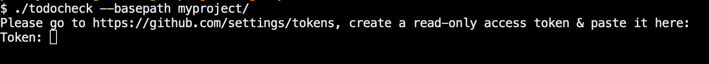
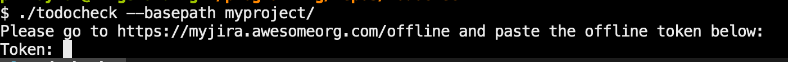
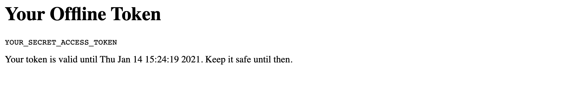

# todocheck

todocheck is a static code analyzer for annotated `TODO` comments.

It let's you create actionable `TODOs` by annotating them with issues from any of the [supported issue trackers](#supported-issue-trackers).  
No longer will you discover arcane, undocumented `TODO` comments, scattered across your code base.

See [How it works](#how-it-works) for more info.

# Table of Contents
- [How it works](#how-it-works)
- [Installation](#installation)
- [Quickstart](#quickstart)
- [Supported Issue Trackers](#supported-issue-trackers)
  * [Github](#github)
  * [Gitlab](#gitlab)
  * [Jira](#jira)
  * [Pivotal Tracker](#pivotal-tracker)
  * [Redmine](#redmine)
- [Supported Programming Languages](#supported-programming-languages)
- [Ignored Files & Directories](#ignored-files--directories)
- [Supported Output Formats](#supported-output-formats)
- [Authentication](#authentication)
  * [None](#none)
  * [API Token/Offline Token](#api-tokenoffline-token)
  * [Authentication Tokens Cache](#authentication-tokens-cache)
  * [Auth Token via Environment Variable](#auth-token-via-environment-variable)
- [Configuration](#configuration)

# How it works
Here's an example of an annotated `TODO`:
```
// TODO J123: Fix this typo
func fuu() {
    ...
}
```

In case the linked issue `J123` is open, `todocheck` will not report any error. In case it is closed or doesn't exist, todocheck will show an error:  
```
ERROR: Issue is closed.
myproject/main.go:12: // TODO J123: Fix this typo

ERROR: Issue doesn't exist.
myproject/main.go:14: // TODO J321: A non-existent issue
```

If there is an unannotated `TODO` in your code base, todocheck will also report it as a malformed `TODO`:
```
ERROR: Malformed todo.
myproject/main.go:16: // TODO - This is not a valid annotated todo
```


Only `TODO`s with valid, open issues are allowed to exist in the codebase.  

By integrating todocheck in your development workflow & CI pipeline, you can ensure that there will be no half-baked issue closed with pending `TODO`s in the codebase.  

# Installation
Download the binary for your OS from the [latest release](https://github.com/preslavmihaylov/todocheck/releases/latest).

Optionally verify the `sha256` checksum:
 * For macos, run `shasum -a 256 <binary>` & verify it's the same as `<binary>.sha256`
 * For linux, run `sha256sum <binary>`
 * For windows, use [a SHA256 checksum utility](https://kanguru.zendesk.com/hc/en-us/articles/235228027-SHA256-Checksum-Utilities)
 
 Afterwards, verify the shasum is the same as `<binary>.sha256`.

Place the binary in a folder, shined upon by your `$PATH`.
 * For macos & linux, that's typically `/usr/local/bin/`

# Quickstart
First, you need to configure `todocheck`'s integration with your issue tracker.
This is done by creating a `.todocheck.yaml` file in the root of your project.

For public github or gitlab repositories, you don't need to specify a config file, as long as you are using git, as `todocheck` will interpret your issue tracker from the git configuration.

Alternatively, the explicit configuration for a public github repository would look like this:
```
origin: github.com/user/repository
issue_tracker: GITHUB
```

See [Supported Issue Trackers](#supported-issue-trackers) for more issue tracker options.

After the config file is in place, simply run `todocheck` from the root of your project.

In case you are running `todocheck` from a different directory, you can specify your project's path using the `--basepath` flag and the project configuration with `--config`:
```
$ todocheck --basepath path/to/project --config path/to/config/.todocheck.yaml
```

If the `--config` option is not specified, the configuration in the basepath will be used.  
In the example above, it would look for it in `path/to/project/.todocheck.yaml`.

# Supported Issue Trackers
Currently, todocheck supports the following issue trackers:

| Issue Tracker                                   | Description                                                           |
|-------------------------------------------------|-----------------------------------------------------------------------|
| [Github](https://github.com)                    | Both public & private repositories are supported                      |
| [Gitlab](https://gitlab.com/)                   | Both public & private repositories are supported                      |
| [Jira](https://www.atlassian.com/software/jira) | Supported via offline tokens                                          |
| [Pivotal Tracker](https://pivotaltracker.com/)  | Supported via an API token                                            |
| [Redmine](https://redmine.org/)                 | Supports public access with no auth & private access via an API token |

## [Github](https://github.com)
To integrate with a public github repository, there's no need to provide a `.todocheck.yaml` explicitly as it can automatically detect the issue tracker based on the git remote address.
And if you want to be explicit, please specify the origin of your repo and the `GITHUB` issue tracker in your `.todocheck.yaml` configuration:
```
origin: github.com/user/repository
issue_tracker: GITHUB
```

To integrate with a private github repository, you'll also need to specify the `auth` section with the `apitoken` type:
```
origin: github.com/user/repository
issue_tracker: GITHUB
auth:
  type: apitoken
```

The first time you run the application, it will ask for your [personal access token](https://docs.github.com/en/github/authenticating-to-github/creating-a-personal-access-token):


After you've specified it, it will store it in the auth tokens cache for subsequent executions. See the [Authentication](#authentication) section for more info.

## [Gitlab](https://gitlab.com)
To integrate with a public gitlab repository, there's no need to provide a `.todocheck.yaml` explicitly as it can automatically detect the issue tracker based on the git remote address.
And if you want to be explicit, please specify the origin of your repo and the `GITLAB` issue tracker in your `.todocheck.yaml` configuration:
```
origin: gitlab.com/user/repository
issue_tracker: GITLAB
```

To integrate with a private gitlab repository, you'll also need to specify the `auth` section with the `apitoken` type:
```
origin: github.com/user/repository
issue_tracker: GITLAB
auth:
  type: apitoken
```

The first time you run the application, it will ask for your [personal access token](https://docs.gitlab.com/ee/user/profile/personal_access_tokens.html):

After you've specified it, it will store it in the auth tokens cache for subsequent executions. See the [Authentication](#authentication) section for more info.

## [Jira](https://www.atlassian.com/software/jira)
To integrate with your organization's Jira, you'll need to specify `JIRA` as your issue tracker, the origin of your jira server instance, along with an [offline token](#api-tokenoffline-token):
```
origin: https://myjira.awesomeorg.com
issue_tracker: JIRA
auth:
  type: offline
  offline_url: https://myjira.awesomeorg.com/offline
```

After you run todocheck for the first time, it will request your offline token:


Example offline token page:


After you've given the offline token to `todocheck`'s prompt, it will store it in the auth tokens cache for subsequent executions.  

See the [Authentication](#authentication) section for more info.

## [Pivotal Tracker](https://pivotaltracker.com/)
To integrate with a pivotal tracker project, specify the origin of your project and the `PIVOTAL_TRACKER` issue tracker in your `.todocheck.yaml` configuration.  
You should also specify the `apitoken` as an auth type:
```
origin: pivotaltracker.com/projects/PROJECT_ID
issue_tracker: PIVOTAL_TRACKER
auth:
  type: apitoken
```

The first time you run the application, it will ask for your [API Token](https://www.pivotaltracker.com/help/articles/api_token/).

After you've specified it, it will store it in the auth tokens cache for subsequent executions. See the [Authentication](#authentication) section for more info.

## [Redmine](https://redmine.org)
To integrate with a redmine issue tracker project, specify the origin of your installation (without project path) and the `REDMINE` issue tracker in your `.todocheck.yaml` configuration.  

You should also specify the `apitoken` as an auth type if you have authentication enabled on your server:
```
origin: https://redmine.mycorp.com
issue_tracker: REDMINE
auth:
  type: apitoken
```

Alternatively, if no authentication is required, don't include the `auth` section.

The first time you run the application, it will ask for your [API Token](https://www.redmine.org/projects/redmine/wiki/rest_api#Authentication).

After you've specified it, it will store it in the auth tokens cache for subsequent executions. See the [Authentication](#authentication) section for more info.

In order to integrate todocheck with your redmine server, you'll need to enable the server's rest API and, optionally, enable authentication - [See Docs](https://www.redmine.org/projects/redmine/wiki/rest_api#Authentication).


# Supported Programming Languages
Currently, todocheck has parsers for three different types of comments:
 * Standard comments like `//` and `/* */`
 * Scripts using single-line comments `#`
 * Python with its `#` single-line and `"""` multi-line comments

Based on this, here are the supported languages:

| Supported Languages   | Description                                                                                                            |
|-----------------------|------------------------------------------------------------------------------------------------------------------------|
| Bash/Zsh              | `*.sh/*.bash/*.zsh` extension. Supports `#` single-line comments                                                       |
| C                     | `*.c` extension. Supports single-line `//` comments and multi-line `/* */` comments                                    |
| C++                   | `*.cpp` extension. Supports single-line `//` comments and multi-line `/* */` comments                                  |
| CSharp                | `*.cs` extension. Supports single-line `//` comments and multi-line `/* */` comments                                   |
| Golang                | `*.go` extension. Supports single-line `//` comments and multi-line `/* */` comments                                   |
| Groovy                | `*.groovy`, `*.gvy`, `*.gy`, `*.gsh` extensions. Supports single-line `//` comments and multi-line `/* */` comments    |
| Java                  | `*.java` extension. Supports single-line `//` comments and multi-line `/* */` comments                                 |
| JavaScript/Typescript | `*.js/*.ts` extension. Supports single-line `//` comments and multi-line `/* */` comments                              |
| PHP                   | `*.php` extension. Supports single-line `#` and `//` comments and multi-line `/* */` comments                          |
| Python                | `*.py` extension. Supports single-line `#` comments and multi-line `"""` comments                                      |
| R                     | `*.R` extension. Supports single-line `//` comments and multi-line `/* */` comments                                    |
| Rust                  | `*.rs` extension. Supports single-line `//` comments and multi-line `/* */` comments                                   |
| Scala                 | `*.scala`, `*.sc` extensions. Supports single-line `//` comments and multi-line `/* */` comments                                 |
| Swift                 | `*.swift` extension. Supports single-line `//` comments and multi-line `/* */` comments                                |

If you don't see your favorite language in this table, but it does use one of the supported comment formats, submit an issue [here](https://github.com/preslavmihaylov/todocheck/issues/new)

# Ignored Files & Directories
If you want certain project files not to be included for todocheck processing, you can specify that in an `ignored` section in the `.todocheck.yaml` configuration:
```
origin: some.origin.com
issue_tracker: JIRA
ignored:
  - vendor-folder/
  - scripts/*.sh
```

Ignored files/folders can be specified via standard pattern-matching.
Hidden files (dotfiles, i.e. `.git`, `.gitignore`, etc) are ignored by default.

# Supported Output Formats
Currently, todocheck supports two kinds of output - standard & json.  

The standard format is meant to be user-friendly & used in the normal day-to-day workflow.  
```
ERROR: Malformed todo
tmp/main.groovy:2: // TODO: Invalid todo
        > TODO should match pattern - TODO {task_id}:

ERROR: Malformed todo
tmp/main.groovy:12: // TODO: Invalid todo
        > TODO should match pattern - TODO {task_id}:

ERROR: Issue doesn't exist
tmp/main.groovy:15: // TODO 3: A non-existent issue
```

The json output is meant to be used for integrating todocheck in third-party systems, such as an IDE plugin.  
To use json output, use the `--format json` flag.
```json
[
   {
      "type":"Malformed todo",
      "filename":"tmp/main.groovy",
      "line":2,
      "message":"TODO should match pattern - TODO {task_id}:"
   },
   {
      "type":"Malformed todo",
      "filename":"tmp/main.groovy",
      "line":12,
      "message":"TODO should match pattern - TODO {task_id}:"
   },
   {
      "type":"Issue doesn't exist",
      "filename":"tmp/main.groovy",
      "line":15,
      "message":""
   }
]
```

# Authentication
## None
For public repositories, todocheck requires no authentication as the issues in the issue tracker are publicly available.
In this case, you need not specify any `auth` section in your configuration or explicitly set it as `none`:
```
origin: github.com/user/repository
issue_tracker: GITHUB
auth: 
  type: none
```

## API Token/Offline Token
For private repositories, todocheck requires an authentication token which the user specifies via a secure prompt.

For github & gitlab, there is a **personal access token** one can get in his user settings & todocheck can use that to read your repository's issues. 
[Github docs](https://docs.github.com/en/github/authenticating-to-github/creating-a-personal-access-token) [Gitlab docs](https://docs.gitlab.com/ee/user/profile/personal_access_tokens.html)

To use this authentication type, configure the auth type as `apitoken`:
```
origin: github.com/user/repository
issue_tracker: GITHUB
auth: 
  type: apitoken
```

For Jira, you'll need to specify an offline token:
```
origin: https://myjira.awesomeorg.com
issue_tracker: JIRA
auth:
  type: offline
  offline_url: https://myjira.awesomeorg.com/offline
```

An offline token is one which your user can get by accessing a specific page, where your server generates an access token.  

Example offline token page:


After you've received either an api token (github/gitlab) or an offline token, you can paste it in todocheck's secure prompt when asked.  
Example with github PAT prompt:


Afterwards, todocheck will not ask for your token again as it will store it in its [tokens cache](#authentication-tokens-cache).

## Authentication Tokens Cache
Whenever a user grants todocheck an auth token, the token will be stored in a file `~/.todocheck/authtokens.yaml`.

If that file doesn't already exist, it will be created with read/write permissions for current user only (permission `0700`).

This file stores a key-value mapping of project origin to auth token.  
Whenever todocheck runs, it first checks this file for an existing authentication token before contacting the issue tracker's server.

If you want to specify a different tokens cache, you can set the `tokens_cache` section in your `.todocheck.yaml` configuration:
```
# remainder omitted
auth:
  # remainder omitted
  tokens_cache: path/to/tokens_cache
```

## Auth Token via Environment Variable
If you need to pass an authentication token via an environment variable, use the `TODOCHECK_AUTH_TOKEN` environment variable.

Example usage:
```
TODOCHECK_AUTH_TOKEN=<secret-token> todocheck --basepath path/to/project
```

This can be useful when you want to integrate todocheck in your CI pipeline.

# Configuration
In your `.todocheck.yaml` configuration, you have the following configuration options:
 * origin - the origin of your remote repository/issue tracker (example: `github.com/golang/go`)
 * issue_tracker - the issue tracker type you're using. Possible options - `GITHUB`, `GITLAB`, `JIRA`
 * ignored - a list of directories/files todocheck should ignore. Supports pattern-macthing, e.g. `*.sh`.
 * auth - the authentication configuration for your issue tracker. If not present, it defaults to auth `type: none`
   * type - the type of authentication. Possible options - `none` (default), `offline`, `apitoken`A
   * offline_url - the url for fetching offline tokens. Only used when type is `offline`
   * tokens_cache - the location of your auth tokens cache. Defaults to `~/.todocheck/authtokens.yaml`

In your tokens cache (default: `~/.todocheck/authtokens.yaml`), authentication tokens are stored in the following format:
```
tokens:
  github.com/user1/repo1: SECRET_TOKEN_1
  gitlab.com/user2/repo2: SECRET_TOKEN_2
  https://jira.awesomeorg.com/offline: SECRET_TOKEN_3
```

If you'd like to explicitly specify an access token in this file, feel free to do so. 
This will let the user not have to manually input the token on the first todocheck execution.  

This can be used e.g. in a CI environment, in an initial laptop setup script, etc.  
Alternatively, use an [Auth Token via Environment Variable](#auth-token-via-environment-variable)
